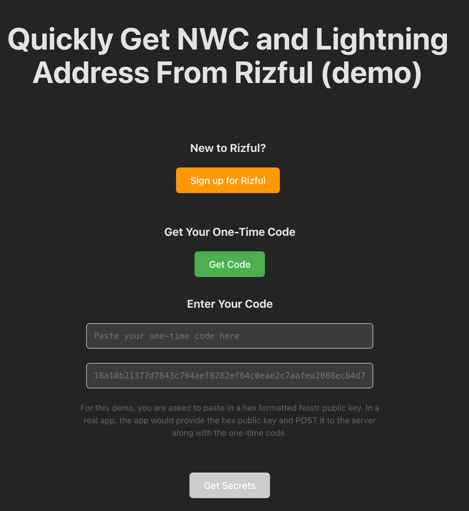

# Rizful Integration Demo

A React + TypeScript demonstration of integrating with Rizful's OAuth-like flow to obtain Nostr Wallet Connect (NWC) URIs and Lightning addresses.




# What does the Nostr application get out of this in the end?

You can see the green "get code" button. (You can rename the buttons in your application, of course.) When the user clicks "get code", if the authorization is successful, you will see an NWC code and a Lightning Address written to the screen. (Look for `<strong>NWC URI:</strong>` in the code.)

For this demo, the NWC code and Lightning Address are written to the screen, but in YOUR application, you should

1. Save the NWC code so the user can use it to make Lightning payments.. remember a NWC code is sensitive, never write this to your server unless you are really sure you can do it securely.. ideally it never leaves the user's device!
2. Apply the Lightning Address to the user's profile (LUD), and sync that with Nostr relays as the user's metadata.
3. Use the Lightning Address also as the Nip-05 for the user's profile, and sync that with Nostr relays as the user's metadata. (If you want.)

## Assumptions

Some existing wallet services identify users by nostr public/private keys, and allow signup without an email address or other means for the user to recover their funds.

Our view is that this is totally dangerous for normies, who:

1. Will likely reveal their nsec to lots of sketchy apps
2. Will likely misplace their nsec
3. Will forget where their sats are actually stored, and have no record of it in their email or elsewhere.

In all these cases, their funds will disappear.

Rizful's approach is more conservative:

1. We think that a user's funds should NOT be connected to their nsec.
2. We allow "burner" emails and VPNs, but DO require email/password login, with optional 2FA.

Since the user has an email in their inbox from Rizful, a user should never lose access to his/her funds, as their password can be reset by email.

It's not 100% cyberpunk, but it's practical and the right way to onboard normies to zaps (in our opinion.)

## Overview

This demo application showcases how to integrate with Rizful's authentication system to securely obtain credentials. It demonstrates a three-step process that external applications can implement to enable their users to connect their Rizful vault.

## Features

- **Secure Authentication Flow**: OAuth-like process without exposing private keys
- **NWC URI Generation**: Get Nostr Wallet Connect URI
- **Lightning Address Retrieval**: Obtain Lightning address for receiving payments
- **Responsive Design**: Works on desktop and mobile devices

## Workflow

The application implements a three-step authentication flow:

### 1. Account Creation (Optional)

- New users can create a Rizful account by clicking "Sign up for Rizful"
- Opens Rizful's signup page in a popup window
- Existing users can skip this step

### 2. Authorization Code Generation

- Users click "Get Code" to open Rizful's token generation page
- They authorize the integration and receive a one-time code
- This code is time-limited and single-use for security

### 3. Token Exchange

- Users paste their one-time code into the demo app
- Users provide their Nostr public key (hex format, 64 characters)
- The app exchanges these credentials with Rizful's server
- On success, receives:
  - **NWC URI**: For making Bitcoin transactions
  - **Lightning Address**: For receiving payments
  - **Confirmed Public Key**: Verification of the provided key

### Technical Flow

```
User → Rizful (Get Code) → Demo App (Exchange) → Rizful API → Credentials
```

1. **GET** `https://rizful.com/nostr_onboarding_auth_token/get_token` - Get authorization code
2. **POST** `https://rizful.com/nostr_onboarding_auth_token/post_for_secrets` - Exchange for credentials

## Configuration

### Custom Rizful URL

You can configure the application to use a custom Rizful instance by setting the `VITE_RIZFUL_ORIGIN` environment variable.

## Getting Started

### Prerequisites

- Node.js 22.12 or higher
- npm or yarn package manager

### Local Development

1. **Clone and install dependencies:**

   ```bash
   git clone <repository-url>
   cd rizful-integration-demo
   npm install
   ```

2. **Configure Rizful URL:**

Create a `.env` file in the project root:

```env
VITE_RIZFUL_ORIGIN=https://rizful.com
```

3. **Start development server:**

   ```bash
   npm run dev
   ```

4. **Open in browser:**
   Navigate to `http://localhost:3008`

## API Integration

### Token Exchange Endpoint

**POST** `rizful.com/nostr_onboarding_auth_token/post_for_secrets`

**Request:**

```json
{
  "secret_code": "one-time-code-from-rizful",
  "nostr_public_key": "64-character-hex-public-key"
}
```

**Response:**

```json
{
  "nwc_uri": "nostr+walletconnect://...",
  "lightning_address": "user@rizful.com",
  "nostr_public_key": "64-character-hex-public-key"
}
```

## Development Scripts

```bash
npm run dev      # Start development server with hot reload

```
